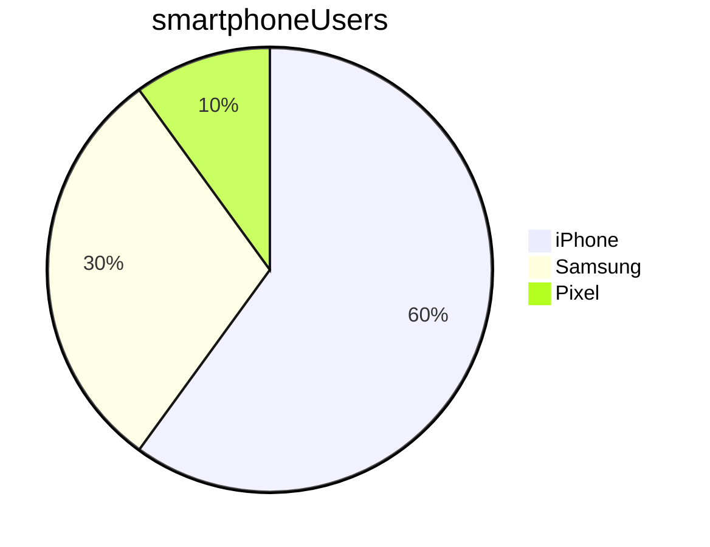

# Learn markdown

## Markdown basics

### subheading

### Marking code 

This is how you print something to the screen in Python: `print("Hello")`

```python
print("Hello")
print("World")
```
### Lists


* bullet point 1 
* bullet point: 2


1. item 1
2. item 2


* bullet 
  * bullet point 1
  * bullet point 2
  

1. item 1 
   1. item 2
   2. item 3


1. step 1...
   * abc
   * xyz

>Note:
> 
> if response is important, use numbered steps, otherwise bullet points  
> numbers show sequential order 

### highlighting text 

This is how you do **bold**


_This is how to do italics_

Click here to go to [Google](https://google.com)

- [ ] cat food
- [ ] drinks
- [x] bread


    Name    |   Street   |  Town
    --------|------------|----------
    Cathy   | Main St    | Birmingham
    John    | Maple Drive  | Stafford

### mermaid for charts



[//]: # 
(need to comment this out )